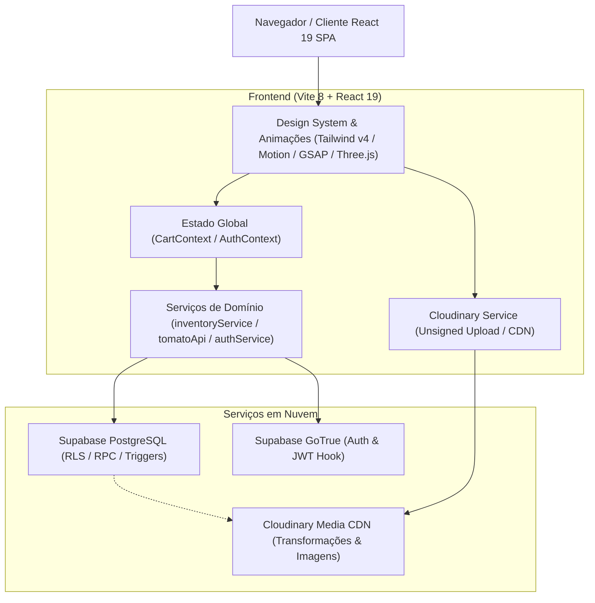
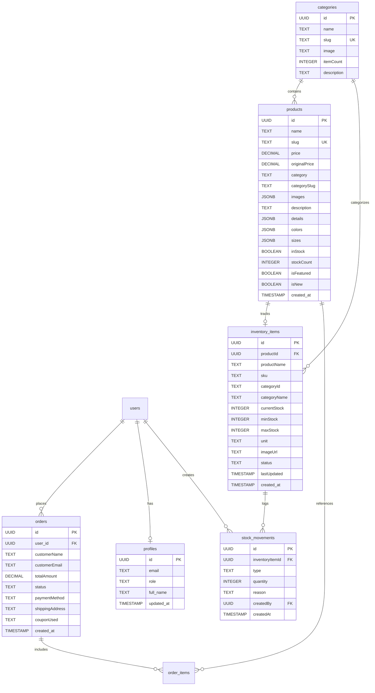
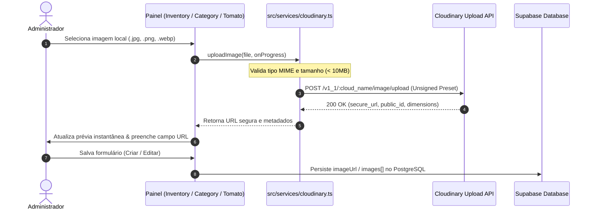

# 🏛️ Arquitetura do Sistema - Vitta Basics (TomatoPHP Inventory & E-commerce)

Este documento descreve detalhadamente a arquitetura técnica, modelo de dados, contratos de camadas, fluxos de integração e decisões de engenharia da plataforma **Vitta Basics**.

---

## 📑 Sumário

1. [Visão Geral & Stack Tecnológica](#1-visão-geral--stack-tecnológica)
2. [Hierarquia de Camadas & Contratos Arquiteturais](#2-hierarquia-de-camadas--contratos-arquiteturais)
3. [Arquitetura de Dados & Backend (Supabase PostgreSQL)](#3-arquitetura-de-dados--backend-supabase-postgresql)
4. [Arquitetura de Mídia & CDN (Cloudinary)](#4-arquitetura-de-mídia--cdn-cloudinary)
5. [Módulo TomatoPHP Inventory & Gestão de Estoque](#5-módulo-tomatophp-inventory--gestão-de-estoque)
6. [Gerenciamento de Estado Global (Context API)](#6-gerenciamento-de-estado-global-context-api)
7. [Design System, UI Avançada & Efeitos 3D](#7-design-system-ui-avançada--efeitos-3d)
8. [Segurança, Autenticação & Autorização](#8-segurança-autenticação--autorização)
9. [Observabilidade, Resiliência & Qualidade de Código](#9-observabilidade-resiliência--qualidade-de-código)
10. [Variáveis de Ambiente & Configuração](#10-variáveis-de-ambiente--configuração)

---

## 1. Visão Geral & Stack Tecnológica

O **Vitta Basics** é uma plataforma moderna de comércio eletrônico minimalista de alta performance, projetada com foco em experiência visual imersiva (Luxury Dark Aesthetic), gestão rigorosa de estoque em tempo real e arquitetura desacoplada e escalável.



### Tecnologias Principais:
- **Core Frontend**: React 19, TypeScript 6, Vite 8.
- **Estilização**: Tailwind CSS v4 (`@tailwindcss/vite`), CSS Modules e animações customizadas.
- **Gráficos & Experiência Imersiva**: Three.js, `@react-three/fiber`, `@react-three/drei`, OGL, GSAP, Framer Motion, Canvas Confetti.
- **Backend-as-a-Service**: Supabase (PostgreSQL 15+, Supabase Auth com JWT Custom Claims Hook, Row Level Security, RPC Functions).
- **Mídia e Imagens**: Cloudinary (Upload unsigned, CDN global de mídia, transformações automáticas de formato WebP/AVIF).
- **Testes & Qualidade**: Vitest, React Testing Library, Playwright (E2E), Oxlint, Biome.

---

## 2. Hierarquia de Camadas & Contratos Arquiteturais

O projeto segue um modelo estrito de **Layered Architecture** com validação de contratos (`architecture.contract.json`). A regra fundamental é o fluxo unidirecional de dependências: camadas de nível superior podem consumir camadas inferiores, mas nunca o inverso.

```
┌────────────────────────────────────────────────────────────────────────┐
│                                App.tsx                                 │
└───────┬───────────────────────────┬────────────────────────────┬───────┘
        │                           │                            │
        ▼                           ▼                            ▼
┌───────────────┐           ┌───────────────┐            ┌───────────────┐
│  pages/       │           │  admin/       │            │  components/  │
└───────┬───────┘           └───────┬───────┘            └───────┬───────┘
        │                           │                            │
        └───────────────────────────┼────────────────────────────┘
                                    │
                                    ▼
                            ┌───────────────┐
                            │   context/    │ (AuthContext, CartContext)
                            └───────┬───────┘
                                    │
                                    ▼
                            ┌───────────────┐
                            │   services/   │ (inventory, tomatoApi, auth, cloudinary)
                            └───────┬───────┘
                                    │
                                    ▼
                            ┌───────────────┐
                            │    types/     │ (Zero dependências externas)
                            └───────────────┘
```

### Regras Estritas de Integridade (`architecture.contract.json`):
1. **Camada de Types (`src/types/`)**:
   - É a fundação do sistema (`ecommerce.ts`, `inventory.ts`).
   - Não possui nenhuma dependência de bibliotecas de terceiros ou camadas internas.
2. **Camada de Serviços (`src/services/`)**:
   - Contém comunicação com o Supabase, Tomato API, Cloudinary e Observabilidade.
   - Depende estritamente de `types` e `config`.
3. **Camada de Contexto (`src/context/`)**:
   - Mantém estado de sessão, carrinho, persistência em localStorage e notificações toast.
   - Só pode consumir `services` e `types`.
4. **Camada de Componentes UI Atômicos (`src/components/ui/`, `src/components/reactbits/`)**:
   - Componentes visuais puros (`Skeleton`, `LazyImage`, `BlurText`, `SpotlightCard`).
   - Devem ser totalmente agnósticos a regras de negócio e acoplamento de dados.
5. **Prevenção de Dependências Circulares**:
   - É estritamente proibido importar componentes visuais ou páginas dentro de arquivos de serviço ou contexto.

---

## 3. Arquitetura de Dados & Backend (Supabase PostgreSQL)

O modelo de dados reside no PostgreSQL do Supabase, protegido por **Row Level Security (RLS)** em todas as tabelas e enriquecido por RPCs seguras e hooks de autenticação.



### Políticas de Segurança (Row Level Security - RLS):
- **Catálogo (`products`, `categories`, `inventory_items`)**:
  - `SELECT`: Público (`true`) para que clientes e visitantes naveguem na loja e consultem a disponibilidade.
  - `INSERT / UPDATE / DELETE`: Exclusivo para usuários autenticados cujo claim `role` no JWT seja `'admin'`.
- **Movimentações de Estoque (`stock_movements`)**:
  - Apenas administradores autenticados têm permissão de leitura e criação de registros de auditoria.
- **Pedidos (`orders`, `order_items`)**:
  - Clientes podem consultar exclusivamente seus próprios pedidos (`auth.uid() = user_id`).
  - Administradores têm acesso irrestrito para gerenciamento e atualização de status de entrega.

---

## 4. Arquitetura de Mídia & CDN (Cloudinary)

O gerenciamento de fotos de produtos e capas de categorias utiliza o Cloudinary como serviço de armazenamento e entrega de ativos visuais de alta fidelidade via CDN.



### Destaques da Implementação:
1. **Upload Direto e Seguro (Unsigned Upload Preset)**:
   - Configurado com `VITE_CLOUDINARY_CLOUD_NAME` e `VITE_CLOUDINARY_UPLOAD_PRESET`.
   - Dispensa a exposição de chaves privadas (`API Secret`) no código do cliente.
2. **Feedback em Tempo Real**:
   - Suporte a monitoramento de progresso percentual via `XMLHttpRequest` nativo (`xhr.upload.onprogress`).
3. **Integração no Painel de Inventário ([`InventoryPanel.tsx`](file:///c:/Users/Administrator/Desktop/ProjetosMeus/Loja%20Online/src/components/admin/InventoryPanel.tsx))**:
   - Disponível diretamente no modal de criação e edição de peças.
   - Prévia em miniatura, badge identificador e botão de remoção rápida.
   - Sincronização automática entre o registro de estoque (`inventory_items.imageUrl`) e o catálogo de produtos (`products.images`).

---

## 5. Módulo TomatoPHP Inventory & Gestão de Estoque

Inspirado no modelo de inventário do TomatoPHP, o sistema fornece um controle completo e resiliente de suprimentos:

### Indicadores e Regras de Status:
| Status | Condição | Ação do Sistema |
| :--- | :--- | :--- |
| `in_stock` | `currentStock > minStock` | Produto disponível para compra imediata; indicador verde. |
| `low_stock` | `currentStock > 0` e `<= minStock` | Alerta visual no painel admin para reposição urgente. |
| `out_of_stock` | `currentStock <= 0` | Desativação de compra com badge "Esgotado"; bloqueio no checkout. |

### Movimentações Auditadas (`stock_movements`):
- **Entrada (`in`)**: Abastecimento de estoque manual ou por nota de compra.
- **Saída (`out`)**: Baixa por venda efetuada ou saída avulsa.
- **Ajuste (`adjustment`)**: Correção após contagem física de inventário.

### Gestão de Grade & Variações:
- **Tamanhos**: Suporte à grade padrão (`PP`, `P`, `M`, `G`, `GG`, `XG`, `Único`) e tamanhos numéricos customizados (`38`, `40`, `42`).
- **Cores & Swatches**: Estrutura de dados `{ name: string, hex: string }` para renderização precisa das amostras de cor tanto na loja quanto no seletor administrativo.
- **Sincronização Atômica**: Atualizações no inventário refletem automaticamente no catálogo de vitrine (`products`).

---

## 6. Gerenciamento de Estado Global (Context API)

A aplicação utiliza Context Providers dedicados para separar o estado de autenticação do fluxo transacional do cliente:

```
                  ┌──────────────────────┐
                  │     <AppProviders>   │
                  └──────────┬───────────┘
                             │
            ┌────────────────┴────────────────┐
            ▼                                 ▼
   ┌──────────────────┐              ┌──────────────────┐
   │  <AuthProvider>  │              │  <CartProvider>  │
   └────────┬─────────┘              └────────┬─────────┘
            │                                 │
     • user (Session)                  • items (CartItem[])
     • profile (Role, Name)            • subtotal / discount / total
     • login() / logout()              • shippingAddress / shippingCost
     • checkIsAdmin()                  • showToast(msg, type)
                                       • isDrawerOpen
```

- **`AuthContext`**: Observa eventos de sessão com `supabase.auth.onAuthStateChange`, atualiza as credenciais de acesso, sincroniza permissões e controla as rotas administrativas.
- **`CartContext`**: Controla adição de peças com chave única combinada (`${productId}-${size}-${color}`), cálculo de frete simulado com threshold de frete grátis, cupons de desconto (`PRIMEIRACOMPRA`, `VITTA10`) e persistência segura no `localStorage`.

---

## 7. Design System, UI Avançada & Efeitos 3D

O Vitta Basics combina o conceito de alfaiataria de luxo com interfaces interativas futuristas:

- **Estética Visual**:
  - Tema predominantemente escuro (Zinc 950 / Black), detalhes em vidro (`backdrop-blur`), bordas sutis (`border-white/10`) e tipografia monoespaçada em metadados.
- **Componentes Dinâmicos (React Bits)**:
  - `WavesBackground`: Shader WebGL com movimento orgânico fluido para a Hero Section.
  - `LaserFlow` & `MagicRings`: Elementos canvas interativos para seções de destaque e lookbook.
  - `SpotlightCard` & `TiltedCard`: Cards de produto com inclinação 3D via giroscópio/cursor do mouse.
  - `BlurText` & `WarpText`: Efeitos de revelação de texto via GSAP e Framer Motion.
- **Acessibilidade e Desempenho**:
  - Componente `LazyImage` com `IntersectionObserver` para carregamento assíncrono e blur-up placeholder.
  - Skeletons responsivos durante estados de loading.

---

## 8. Segurança, Autenticação & Autorização

1. **Validação Server-Side de Privilégios**:
   - A promoção de usuários para a role `'admin'` é intermediada pela RPC `promote_to_admin(secret_key)`.
   - A chave mestra administrativa não é exposta no bundle frontend (validada via banco ou Supabase Vault).
2. **JWT Custom Claims Hook**:
   - A função PostgreSQL `custom_access_token_hook` injeta o atributo `role` no token JWT durante a autenticação.
   - Isso garante que as políticas RLS avaliem permissões sem requisições adicionais de consulta à tabela de perfis.
3. **Tratamento de Contas e Confirmação de E-mail**:
   - Tratamento específico de exceção para contas não confirmadas com redirecionamento para `EmailConfirmationView`.

---

## 9. Observabilidade, Resiliência & Qualidade de Código

- **Módulo de Observabilidade ([`src/services/observability.ts`](file:///c:/Users/Administrator/Desktop/ProjetosMeus/Loja%20Online/src/services/observability.ts))**:
  - `captureException(error, context)`: Registro padronizado de exceções com rastreamento de ação e componente.
  - `trackEvent(event)`: Telemetria de eventos de negócio (ex: `inventory_image_updated`, `cart_checkout_started`).
  - `measureTime(name, fn)`: Métricas de latência para requisições críticas.
- **Tratamento de Erros de Renderização**:
  - Componente `<ErrorBoundary />` envolvendo rotas para prevenir quebras de tela branca.
- **Bateria de Testes Automatizados**:
  - Testes unitários com Vitest:
    - `cart.test.ts`: Regras de cálculo, cupons e limites do carrinho.
    - `inventory.test.ts` & `inventoryService.test.ts`: Lógica de status de estoque, CRUD e sincronização.
    - `InventoryPanel.test.tsx`: Testes de interação com o painel de inventário, incluindo upload direto para o Cloudinary e grade de tamanhos/cores.
    - `security.test.ts`: Validações de privilégios e proteção de credenciais.

---

## 10. Variáveis de Ambiente & Configuração

As credenciais do sistema são declaradas no arquivo `.env`:

```ini
# Supabase Configuration
VITE_SUPABASE_URL=https://qnkqcljhvnburzbyxwks.supabase.co
VITE_SUPABASE_PUBLISHABLE_KEY=sb_publishable_...

# Cloudinary Configuration (Upload Direto de Mídia)
VITE_CLOUDINARY_CLOUD_NAME=qq1ratii
VITE_CLOUDINARY_UPLOAD_PRESET=Vita_basics

# Admin Secret Key (Configurado exclusivamente no Supabase Vault em produção)
# ADMIN_SECRET_KEY=...
```
